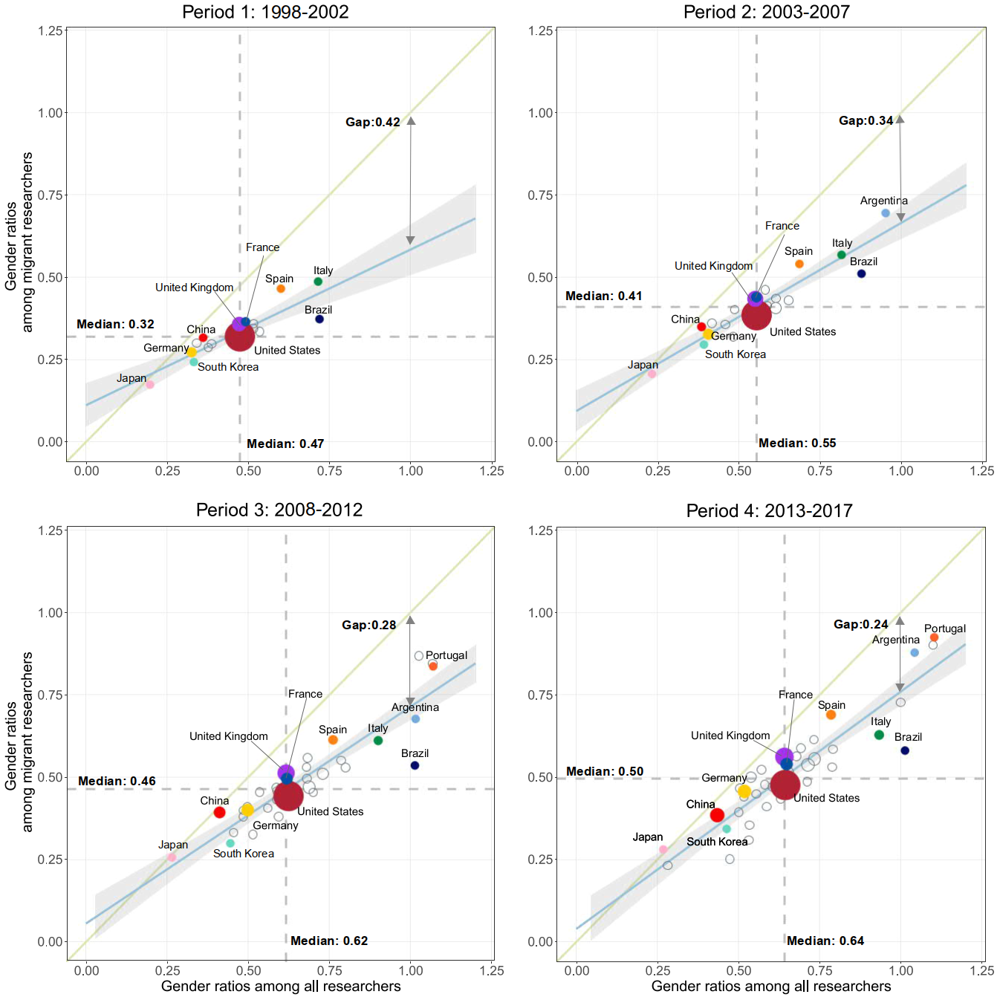
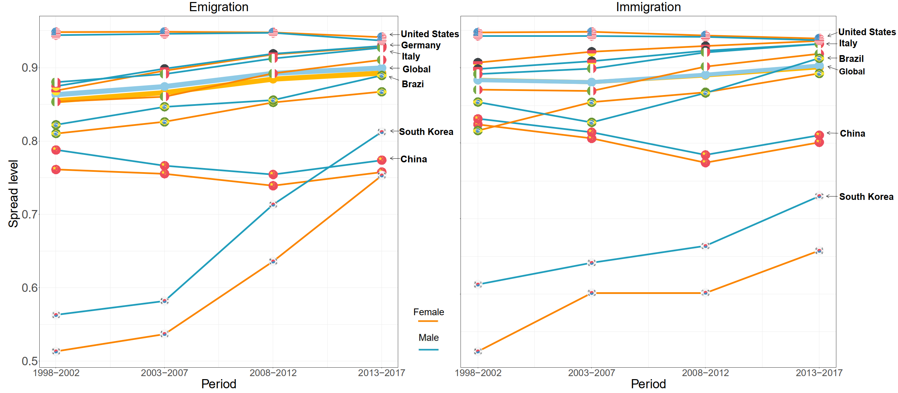
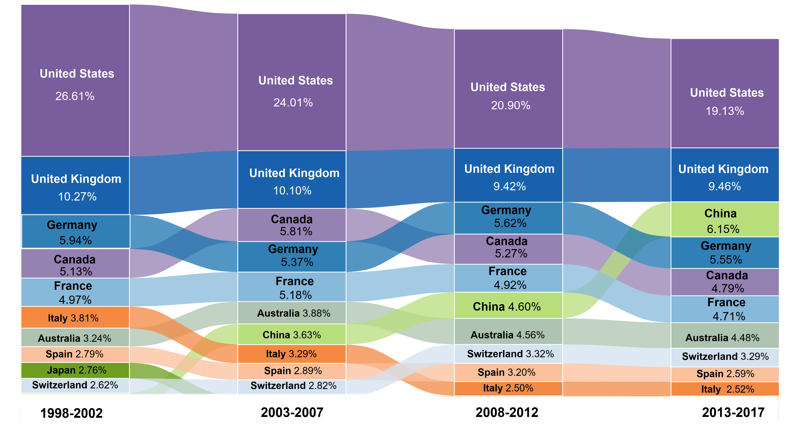
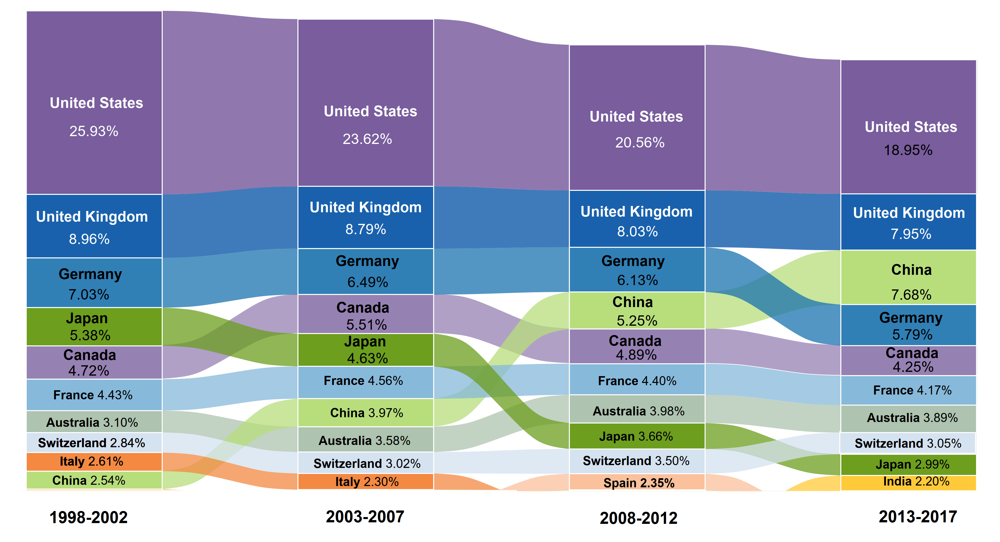
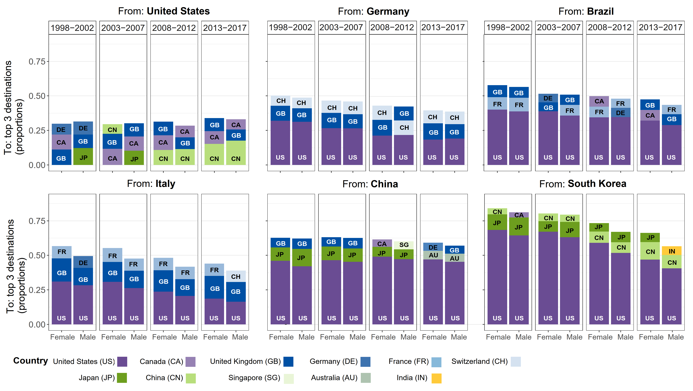

# Replication materials for: A gender perspective on the global migration of scholars

**Maintainer** Xinyi Zhao.

**Date of the last update**: 2023-01-15

**ORCID**: 0000-0002-2552-7795

**Institution1**: Max Planck Institute for Demographic Research, Rostock, Germany

**Institution2**: Leverhulme Centre for Demographic Science, Department of Sociology, University of Oxford, Oxford, UK

**WWW**: https://www.demogr.mpg.de/en/about_us_6113/staff_directory_1899/xinyi_zhao_4083/

**Email**: zhao@demogr.mpg.de

**Email2**: xinyi.zhao@st-hughs.ox.ac.uk

## Publication
**Title**: A gender perspective on the global migration of scholars

**Authors**: Xinyi Zhao, Aliakbar Akbaritabar, Ridhi Kashyap, Emilio Zagheni

**DOI**: XXX-XXX-XXX

**Publication venue and date**: Proceedings of the National Academy of Sciences of the United States of America (PNAS), 2023

**Abstract**:
Although considerable progress toward gender equality in science has been made in recent decades, female researchers continue to face significant barriers in the academic labor market. International mobility has been increasingly recognized as a strategy for scientists to expand their professional networks, and that could help narrow the gender gap in academic careers. Using bibliometric data on over 33 million Scopus publications, we provide the first global and dynamic view of gendered patterns of transnational scholarly mobility, as measured by volume, distance, diversity and distribution, from 1998 to 2017. We find that while female researchers continued to be under-represented among internationally mobile researchers and migrate over shorter distances, this gender gap was narrowing at a faster rate than the gender gap in the population of general active researchers. Globally, the origin and destination countries of both female and male mobile researchers became increasingly diversified, which suggests that scholarly migration has become less skewed and more globalized. However, the range of origin and destination countries continued to be narrower for women than for men. While the US remained the leading academic destination worldwide, the shares of both female and male scholarly inflows to that country declined from around 25% to 20% over the study period, partially due to the growing relevance of China. This study offers a cross-national measurement of gender inequality in global scholarly migration that is essential for promoting gender-equitable science policies, and for monitoring the impact of such interventions.

## Description of the files

### 1. Aggregated_Academic_Migration_Data
+ **0_gendered_net_migration_all.csv**: 
  Country-level inflows and outflows by gender for four time periods (1998-2002, 2003-2007, 2008-2012 and 2013-2017).
+ **0_OD_migration_flow.csv**: 
  Migration Origin-Destination (OD) flows between countries by gender for four time periods.
+ **1_aggregated_global_level_migrant.csv**:
  Global-level academic migration tally and gender ratios among migrant researchers and all researchers (including non-movers) for four time periods. 

### 2. For_figure_1_3_R

**Note on Figures 1-4**:

Replication script will generate the figures as presented in the manuscript. But, a few tweaks and decorative additions (including labels, annotation arrows) are added afterwards to clarify the most important points without changing the underlying data or results.

+ **1_aggregated_country_level_migrant.csv**:
  Country-level academic migration tallies and gender ratios among migrant researchers and all researchers for four time periods, which will be used for **Fig. 1. Gender ratios among all published researchers (X-axis) and migrant researchers (Y-axis)**.



+ **2_country_level_spread.csv**:
   Country-level migration spreads among researchers, which will be used for **Fig. 2.Scholarly emigration and immigration spreads, by gender and across four periods, for selected countries and at the global level**.
+ **2_global_spread_withweighted.csv**:
  Global-level migration spreads, which will be used for **Fig. 2. Scholarly emigration and immigration spreads, by gender and across four periods, for selected countries and at the global level**. 




+ **3_female_preferred_D_global.xlsx**: 
  Destination countries ordered by female immigrant researchers' preferences at the global level. 
+ **3_female_preferred_D_global_top12.xlsx**: 
  A further processed version of *3_female_preferred_D_global.xlsx*, which will be used for **Fig. 3. The 10 most preferred destinations for global mobile researchers by gender**. 
+ **3_male_preferred_D_global.xlsx**: 
  Destination countries ordered by male immigrant researchers' preferences at the global level 
+ **3_male_preferred_D_global_top13.xlsx**: 
  A further processed version of *3_male_preferred_D_global.xlsx*, which will be used for **Fig. 3. The 10 most preferred destinations for global mobile researchers by gender**.






+ **4_female_preferred_D_ctr.xlsx**: 
  First three destinations for emigrant female researchers from different countries, which will be used for **Fig. 4. Top three destinations for mobile researchers by gender at the country level**.
+ **4_male_preferred_D_ctr.xlsx**: 
  First three destinations for emigrant male researchers from different countries, which will be used for **Fig. 4. Top three destinations for mobile researchers by gender at the country level**.



### 3. Data_Analysis_Spread_Destination.ipynb: 
  Source code (Python v3.9) for performing analyses of global-level and country-level gender ratios (**Fig. 1.**), global-level and country-level migration spreads (**Fig. 2.**), global-level and country-level preferred destinations by gender (**Fig. 3.** and **Fig. 4.**). The details of methods can be found in the paper. 

#### Required Python libraries to install
- Python 3*
- numpy
- Pandas
- plotly
- pycountry_convert


### 4. Plot_Code_for_PNAS.R: 
  Source code (R v4.2.1) for plotting **Fig. 1.**, **Fig. 2.**, **Fig. 3.** and **Fig. 4.**. 

### Note on Figures 1-4
Replication script will generate the figures as presented in the manuscript. But, a few labels and annotations are added afterwards to clarify the most important information and serve an aesthetic purpose without changing any underlying data or results.

#### Required R libraries to install
- plotly
- grid
- gridExtra
- scales
- tidyverse (dplyr, ggplot2)
- ggpmisc
- magrittr
- ggh4x
- rlang
- viridis
- patchwork
- hrbrthemes
- circlize
- alluvial
- ggalluvial
- readxl
- RColorBrewer
- ggflags (devtools::install_github('rensa/ggflags'))
- here

### 5. figures
#### Figures_exported_from_R

These are the figures exported from R script `Plot_Code_for_PNAS.R`.

#### Published_manuscript_figures

These are the figures from published manuscript.

# Source and license of the Bibliometric data

This study was granted access to the bibliometric data through the Project "Kompetenzzentrum Bibliometrie" of the German Competence Network for Bibliometrics (https://bibliometrie.info/). The authors also acknowledge their funder Federal Ministry of Education and Research (Bundesministerium für Bildung und Forschung, BMBF) with grant number  16WIK2101A.

By the license terms, we are not allowed to publish any individual level data. All aggregated data to replicate our results, analysis and figures in the published manuscript are uploaded to this repository (as described above).

# Session information for replication purposes

## Python
- python; 3.10.8
- numpy; 1.23.5
- pandas; 1.5.1
- plotly; 5.11.0
- pycountry-convert; 0.7.2


## R

```R

> sessionInfo()
R version 4.2.1 (2022-06-23 ucrt)
Platform: x86_64-w64-mingw32/x64 (64-bit)
Running under: Windows Server x64 (build 17763)

Matrix products: default

locale:
[1] LC_COLLATE=German_Germany.1252  LC_CTYPE=German_Germany.1252    LC_MONETARY=German_Germany.1252
[4] LC_NUMERIC=C                    LC_TIME=German_Germany.1252    

attached base packages:
[1] grid      stats     graphics  grDevices utils     datasets  methods   base     

other attached packages:
 [1] RColorBrewer_1.1-3 readxl_1.4.0       ggalluvial_0.12.3  alluvial_0.1-2     circlize_0.4.15    hrbrthemes_0.8.0  
 [7] patchwork_1.1.2    viridis_0.6.2      viridisLite_0.4.0  gridExtra_2.3      rlang_1.0.6        ggh4x_0.2.3       
[13] magrittr_2.0.3     ggpmisc_0.5.2      ggpp_0.5.0         forcats_0.5.1      stringr_1.4.0      dplyr_1.0.9       
[19] purrr_0.3.4        readr_2.1.2        tidyr_1.2.0        tibble_3.1.7       tidyverse_1.3.1    scales_1.2.0      
[25] plotly_4.10.1      ggflags_0.0.2      ggplot2_3.4.0      here_1.0.1        

loaded via a namespace (and not attached):
 [1] fs_1.5.2            lubridate_1.8.0     httr_1.4.3          rprojroot_2.0.3     tools_4.2.1         backports_1.4.1    
 [7] utf8_1.2.2          R6_2.5.1            DBI_1.1.3           lazyeval_0.2.2      colorspace_2.0-3    withr_2.5.0        
[13] tidyselect_1.1.2    grImport2_0.2-0     compiler_4.2.1      extrafontdb_1.0     cli_3.4.1           rvest_1.0.2        
[19] quantreg_5.93       SparseM_1.81        xml2_1.3.3          systemfonts_1.0.4   digest_0.6.29       rmarkdown_2.14     
[25] base64enc_0.1-3     jpeg_0.1-9          pkgconfig_2.0.3     htmltools_0.5.2     extrafont_0.18      dbplyr_2.2.1       
[31] fastmap_1.1.0       htmlwidgets_1.5.4   GlobalOptions_0.1.2 rstudioapi_0.13     shape_1.4.6         generics_0.1.3     
[37] jsonlite_1.8.0      Matrix_1.4-1        Rcpp_1.0.8.3        munsell_0.5.0       fansi_1.0.3         gdtools_0.2.4      
[43] lifecycle_1.0.3     stringi_1.7.6       MASS_7.3-57         crayon_1.5.1        lattice_0.20-45     haven_2.5.0        
[49] splines_4.2.1       hms_1.1.1           knitr_1.39          pillar_1.7.0        reprex_2.0.1        XML_3.99-0.10      
[55] glue_1.6.2          evaluate_0.15       data.table_1.14.2   modelr_0.1.8        png_0.1-7           vctrs_0.5.1        
[61] tzdb_0.3.0          MatrixModels_0.5-0  Rttf2pt1_1.3.11     cellranger_1.1.0    gtable_0.3.0        assertthat_0.2.1   
[67] xfun_0.31           broom_1.0.0         survival_3.3-1      ellipsis_0.3.2     

```
